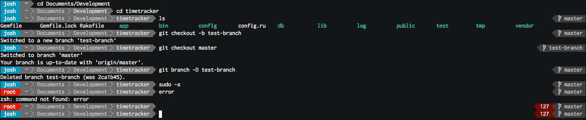

# My iTerm color scheme

This is my iTerm color scheme. Sorry I couldn't think of something fancy to name it.

## Usage:
1. Clone this repo.
2. Open **Preferences** in iterm (⌘,)
3. Click on **Profiles** > **Colors** > **Load Presets** > **Import**
4. Load the `theme.itermcolors` file.

If you want your terminal to look more like mine, install [powerline](http://blog.codefront.net/2013/10/27/installing-powerline-on-os-x-homebrew/).
